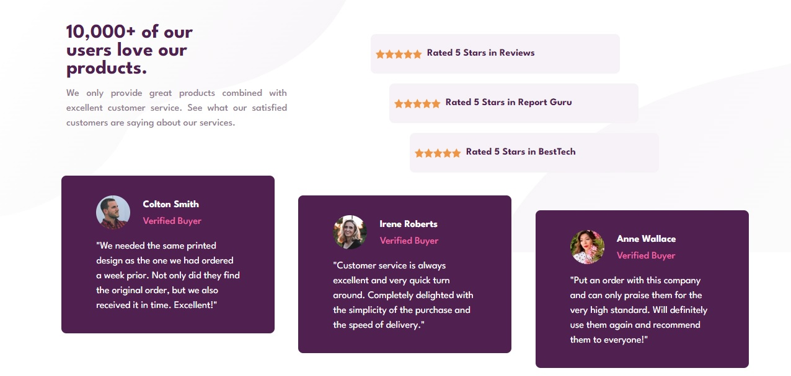

# Frontend Mentor - Social proof section solution

This is a solution to the [Social proof section challenge on Frontend Mentor](https://www.frontendmentor.io/challenges/social-proof-section-6e0qTv_bA). Frontend Mentor challenges help you improve your coding skills by building realistic projects.

## Table of contents

- [Overview](#overview)
  - [The challenge](#the-challenge)
  - [Screenshot](#screenshot)
- [My process](#my-process)
  - [Built with](#built-with)
- [Author](#author)

## Overview

Here is my solution to the Social proof section ✨

😊 Happy to hear any feedback and advice. Thanks!

### The challenge

Users should be able to:

- View the optimal layout for the section depending on their device's screen size

### Screenshot

### Links

- Solution URL: [GitHub](https://github.com/PaulaR-05/Social-proof-section)
- Live Site URL: [Live](https://paular-05.github.io/Social-proof-section/)

### Built with

- Semantic HTML5 markup
- CSS custom properties
- Flexbox
- CSS Grid
- Mobile-first workflow

## Author

- GitHub - [GitHub](https://github.com/PaulaR-05)
- Frontend Mentor - [@PaulaR-05](https://www.frontendmentor.io/profile/PaulaR-05)
